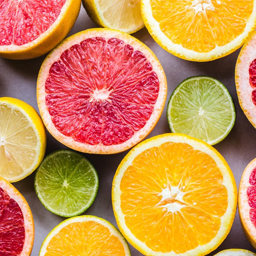

# DEECAMP 总结

**32组 胡晨旭**

### 1. 尝试过得算法

- Canny - [Canny edge detector](https://en.wikipedia.org/wiki/Canny_edge_detector)

- CartoonGAN - [CartoonGAN: Generative Adversarial Networks for Photo Cartoonization](http://openaccess.thecvf.com/content_cvpr_2018/papers/Chen_CartoonGAN_Generative_Adversarial_CVPR_2018_paper.pdf)
- RTV Smooth - [Structure Extraction from Texture via Relative Total Variation](https://github.com/yearway/RTV_Smooth)
- Pix2Pix - [Image-to-Image Translation with Conditional Adversarial Networks](https://arxiv.org/abs/1611.07004)
- CycleGAN - [Unpaired Image-to-Image Translation using Cycle-Consistent Adversarial Networks](https://arxiv.org/abs/1703.10593)

实验效果

CartoonGAN：

    
    

    
    

    
    

RTV Smooth 将原来的matlab代码改为Python代码

可以忽略图片中的纹理，保留图片中的关键部分的边缘线条

**Pix2Pix**

顺序为 realA  fakeB  realB

    
    
    

    
    
    

    
    
    

#### 参考资料：

[1] [CartoonGAN github](https://github.com/znxlwm/pytorch-CartoonGAN)

[2] [RTV Smooth github](https://github.com/yearway/RTV_Smooth)

[3] [Pix2Pix & CycleGAN github](https://github.com/junyanz/pytorch-CycleGAN-and-pix2pix)